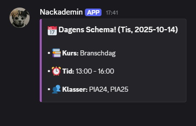

# Nackademin Schedule Bot

### Description
This is a Discord bot that scrapes the Nackademin
school's schedule (which is allowed), and then 
sends a discord message the day before every schoolday with 
the information of tomorrow's lecture, for example what 
course, time, and classroom it is.

### Hosting & problem solving
I am hosting this program on my own Linux-server
and have added the Discord bot to the students
Discord-server, so that everyone can benefit from it.
This solves the problem of having to open up the
schools schedule and search up the information
manually for the day's lecture!

### Discord-message previews

