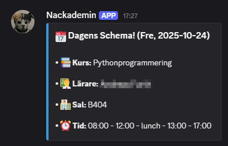

# Nackademin Schedule Bot

### Description
This is a Discord bot that scrapes the Nackademin
school's schedule (which is allowed), and then 
sends a discord message the day before every schoolday with 
the information of tomorrow's lecture, for example what 
course, time, and classroom it is.

### Hosting
I am hosting this program on my own Debian Linux-server
which is running on my RaspberryPi-4. I am also
running this program inside a Docker container using 
Docker-Compose, that I control through the Portainer
interface. I have also mounted a volume to this Docker
container, in order to have the logs file persist when
I update or stop the container.

### Problem solving
I have added this Discord bot to the students
Discord-group, so that everyone can benefit from it.
This solves the problem of having to open up the
schools schedule app and manually search for the 
information about the day's lecture!

### Discord-message previews

